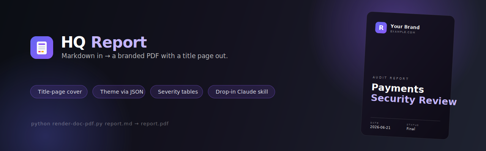
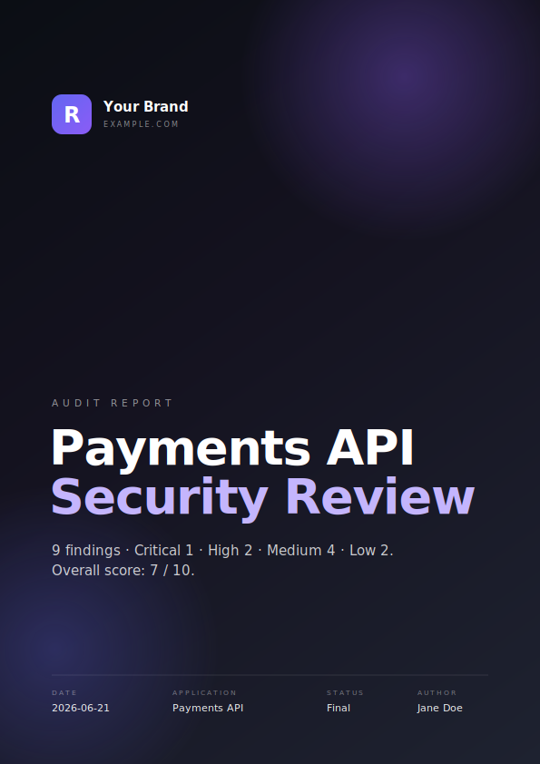

<p align="center">
  
</p>

<p align="center">
  <a href="LICENSE"></a>
  
  
  
</p>

# Branded Report

Turn a Markdown file into a **polished, branded PDF** — with a real **title page**.
Audits, technical reports, plans, security reviews, references: write the words in
Markdown, run one command, get a document with a dark cover, accent-coloured
headings, clean severity tables and a running footer.

The look is fixed by a template. The **brand** — colours, logo badge letter, org
name — is a small JSON file, so the same engine themes any project without touching
a line of CSS. It ships as a drop-in [Claude Code](https://claude.com/claude-code)
skill **and** a standalone CLI.

<p align="center">
  
  <br>
  <em>The title page the renderer produces from the example report's frontmatter.</em>
</p>

---

## Features

- **Title-page cover, automatically.** A dark gradient cover with your logo badge,
  the kind label, title, subtitle and a `Date · Application · Status · Author`
  metadata strip — generated from frontmatter, never built by hand.
- **Theme via one JSON file.** 13 colour tokens + badge letter + org name. Swap
  brands with `--brand brand.json`; recolour everything from a single accent token.
- **Audit-ready body styling.** Accent headings, zebra tables built for
  `CRITICAL / HIGH / MEDIUM / LOW / PASS` findings, callouts, code blocks, a
  page-number footer.
- **Two ways to use it.** Drop the folder into `.claude/skills/`, or call the
  Python renderer directly in any pipeline.
- **No lock-in.** Plain Markdown in, standard PDF out. MIT licensed.

## Quick start

```bash
git clone https://github.com/PlayQodeX/report-skill.git
cd report-skill

# install the renderer's dependencies (see "Requirements" for native libs)
pip install -r branded-report/renderer/requirements.txt

# render the bundled example
python3 branded-report/renderer/render-doc-pdf.py examples/sample-report.md
# -> examples/sample-report.pdf  (page 1 is the branded cover)
```

Theme it your way:

```bash
python3 branded-report/renderer/render-doc-pdf.py examples/sample-report.md \
  --brand branded-report/branding/examples/acme-capital.json
```

## Use it as a Claude Code skill

Copy the self-contained skill folder into your skills directory:

```bash
cp -r branded-report ~/.claude/skills/        # user-wide
# or:  cp -r branded-report .claude/skills/    # one project
```

Then just ask Claude to *"write an audit of X as a branded PDF report"* — the
`branded-report` skill carries the structure, the renderer and the default brand.
`branded-report/SKILL.md` is the entry point; the `references/` files hold the full
spec.

## Use it standalone (CLI)

```
python3 render-doc-pdf.py <source.md | folder> [--out file.pdf] [--brand brand.json] [--template template.html]
```

| Flag | Default | Purpose |
|------|---------|---------|
| `source` | — | A `.md` file, or a folder (renders every `.md` in it) |
| `--out` | `<source>.pdf` | Output path (single file only) |
| `--brand` | auto-discovered `branding/report-brand.json` | Brand JSON to theme with |
| `--template` | bundled `renderer/template.html` | Override the HTML template |

### Frontmatter

```yaml
---
title: Payments API Security Review
subtitle: 9 findings — Critical 1, High 2, Medium 4, Low 2. Score 7/10.
kind: audit            # report | audit | plan | reference | memo | rfc | agent-spec
status: final          # draft | final | review | archived
date: 2026-06-21
author: Jane Doe
app: Payments API      # the subject — cover "Application" field
---
```

All keys are optional; sensible defaults fill anything you omit. `kind` sets the
cover eyebrow and the footer. Optional `org`, `org_tld`, `mark`, `brand` override
the brand per document.

## Branding

Colours, the badge letter and the org name live in
[`branded-report/branding/report-brand.json`](branded-report/branding/report-brand.json).
Edit it to make every report yours, or pass another file with `--brand`. Omitted
keys fall back to the template default, so a minimal re-skin is a few lines.

| Brand file | Identity |
|------------|----------|
| `branding/report-brand.json` | Default — violet on near-black |
| `branding/examples/acme-capital.json` | Pink/blue on deep navy |
| `branding/examples/forest.json` | Emerald on near-black |

Field reference: [`report-brand.schema.json`](branded-report/branding/report-brand.schema.json).
Full guide: [`references/branding.md`](branded-report/references/branding.md).

## Writing a strong report

[`references/report-structure.md`](branded-report/references/report-structure.md)
describes the recommended shape — numbered sections, the
`CRITICAL/HIGH/MEDIUM/LOW/PASS` severity vocabulary, a risk summary, lettered
appendices, and a calm third-person tone. It's guidance, not enforced — any
Markdown renders.

## Project layout

```
report-skill/
├── branded-report/              ← the self-contained skill (copy into .claude/skills/)
│   ├── SKILL.md                 ← skill entry point
│   ├── references/
│   │   ├── design-system.md     ← every colour, font, size; the exact look
│   │   ├── branding.md          ← brand JSON schema + how to re-skin
│   │   └── report-structure.md  ← recommended report structure & tone
│   ├── renderer/
│   │   ├── render-doc-pdf.py     ← the Markdown → PDF renderer
│   │   ├── template.html         ← the brandable HTML/CSS template
│   │   └── requirements.txt
│   └── branding/
│       ├── report-brand.json     ← default brand (edit me)
│       ├── report-brand.schema.json
│       └── examples/             ← acme-capital, forest
├── examples/sample-report.md     ← a complete example input
├── assets/                       ← banner, logo, cover preview
├── README.md · LICENSE · CHANGELOG.md
```

## Requirements

Python 3.9+, and the deps in
[`requirements.txt`](branded-report/renderer/requirements.txt) (PyYAML, Markdown,
**WeasyPrint**). WeasyPrint needs native libraries (Pango / cairo / GDK-PixBuf):

| Platform | Setup |
|----------|-------|
| **Linux** | Install `libpango`, `libcairo`, `libgdk-pixbuf` via your package manager |
| **macOS** | `brew install weasyprint` |
| **Windows** | Render under **WSL**, or install the GTK runtime — bare Windows Python cannot `import weasyprint` |

Fonts: the template asks for **Inter** and **JetBrains Mono**; if they aren't
installed, system fallbacks apply. Install both for a pixel-exact match.

Verify a render: `pdfinfo report.pdf` reports `Producer: WeasyPrint …` and page 1 is
the dark cover.

## How it works

The renderer parses the frontmatter, converts the Markdown body to HTML, fills the
template placeholders (`{{TITLE}}`, `{{MARK}}`, `{{ORG}}`, …), and — when a brand is
active — injects a tiny `:root` override that re-points the template's `--brand-*`
CSS variables. WeasyPrint prints the result to an A4 PDF. The cover, footer,
typography and table styling all live in one template; the brand is the only thing
that varies. See
[`references/design-system.md`](branded-report/references/design-system.md) for the
complete spec.

## License

[MIT](LICENSE) © PlayQodeX. Use it, fork it, ship it.
